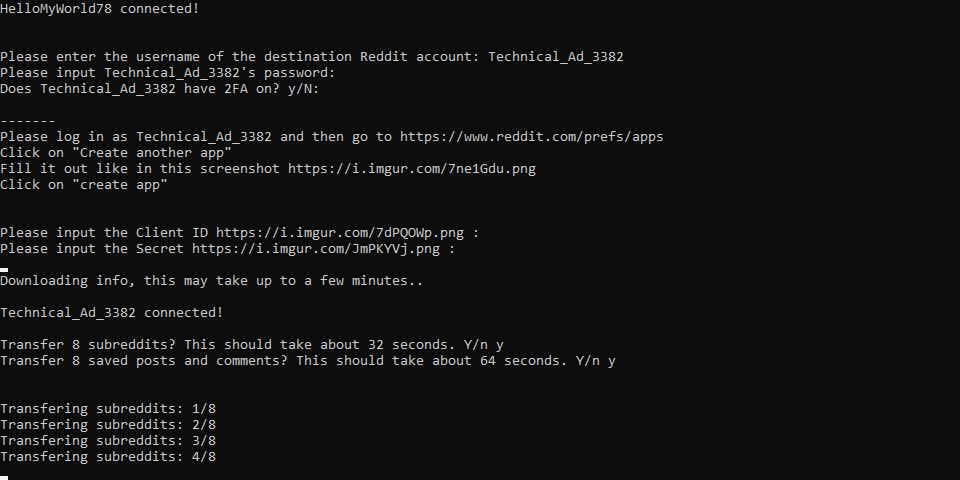

# Reddit Move Tool

Reddit Move Tool is an easy to use Python tool, to transfer your subscribed subreddits and saved items to a new Reddit account.

**How to use:**

    1. [Download](https://github.com/TriLinder/RedditMoveTool/releases) and decompress the file

    2. Run `pip install -r requirements.txt` inside the folder.

    3. Run `redditMoveTool.py`

    4. Done! The script will now walk you through the rest of the process.

**Screenshots:**

